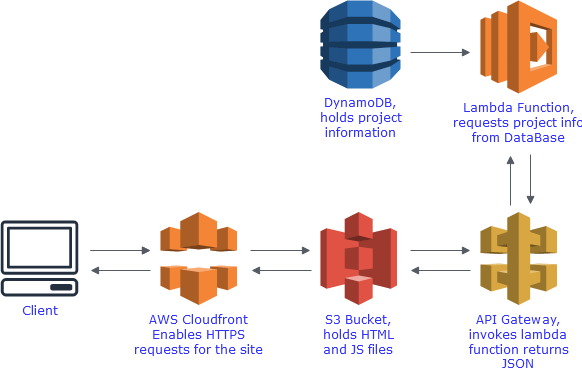
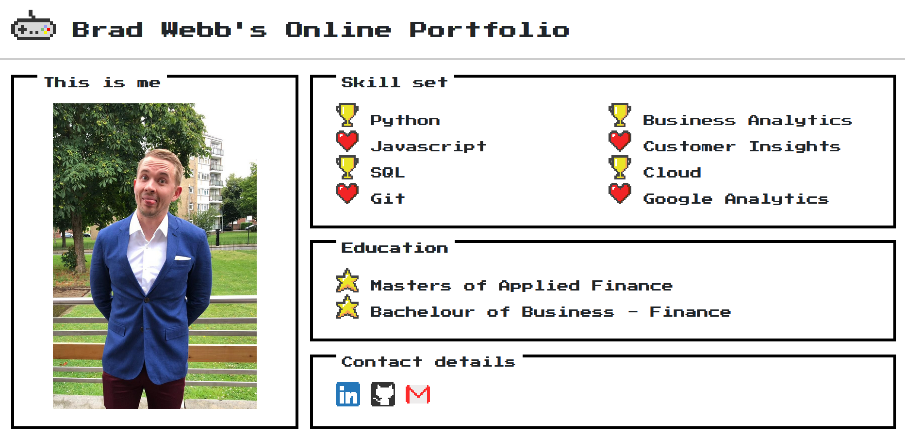

## Personal Project Portfolio
This project is the repository for my personal portfolio website. It is written to show my personal coding projects and provide my contact details.

## Project Example
[Website](https://bradwebb101.com)

## Things i borrowed 
 - CSS library - NES CSS https://github.com/nostalgic-css/NES.css
 - Pokemon Javascript Game https://github.com/panvourtsis/HTML5-canvas-game---POKEMON-

## How is it built
### Front end 
 - This project is built on HTML and vanilla Javascript. This is my first website i have built, so starting from the begining. 

### Back end
 - This site is built as a serverless application, it uses AWS Lambda, S3, DynamoDB, API Gateway and Cloudfront. 
  
## Infrastructure

## Screenshot

## Downloading and using
As this project is just HTML and Vanilla JS, the only dependency to use this project is a web browser. To install clone this repo and open index.html. Website will load in the browser. 

