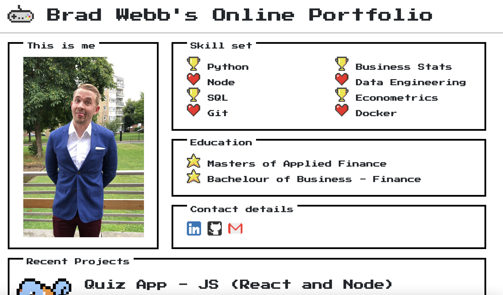
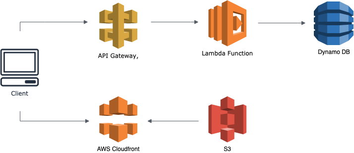

# Personal Project Portfolio

This project is the repository for my personal portfolio website. It is to show my personal projects, contact details and as a way of learning React. This is my first React App I have done, previous front end attemps were coded in HTML and vanilla JS. I have learnt that React is far less frustrating to design and code front ends, the things you learn hey. 

## Screenshot



## Project Example

[Website](https://bradwebb101.com)

## Things i borrowed

- CSS library - NES CSS https://github.com/nostalgic-css/NES.css
- Pokemon Javascript Game https://github.com/panvourtsis/HTML5-canvas-game---POKEMON- (Canvas.js in src/components)

## How is it built

### Front end

- This project is built with React, I migrated this site from my old attempt using HTML and Vanilla JS. 

### Back end

- This site is built as a serverless application, it uses AWS Lambda, S3, DynamoDB, API Gateway and Cloudfront.
  
## Infrastructure



## Downloading and usage

To use this repo you need to clone it with git, into your source folder. 

``` git
git clone https://github.com/BradWebb101/portfolio_website.git .
```

Once you have cloned the files into your source folder, use NPM to install the modules

``` cmd 
npm install 
```

Once NPM has installed the modules, use the NPM run command to mount the app 

``` cmd 
npm run 
```